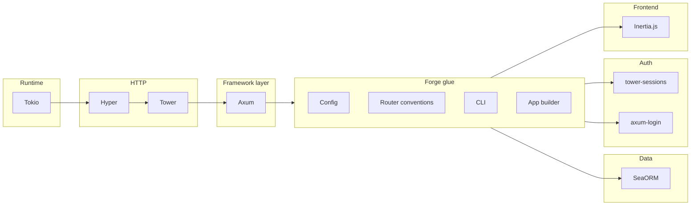

# Forge: Full-Stack Rust Web Framework Plan

## Goal

Deliver a **cohesive** experience: one conventional project layout, one config story, one CLI, and a small set of APIs so that "minimal code achieves maximum result." Reuse the best existing crates instead of reimplementing; Forge is the **glue and conventions** layer on top.

## Reference Frameworks (What We Emulate)


| Concern       | Django                      | Rails                     | AdonisJS              |
| ------------- | --------------------------- | ------------------------- | --------------------- |
| **Routing**   | URLconf, namespaced         | Routes + resources        | Router + resourceful  |
| **Data**      | ORM, migrations, admin      | Active Record, migrations | Lucid ORM, migrations |
| **Auth**      | contrib.auth, sessions      | Devise / built-in         | First-class guards    |
| **Templates** | DTL (batteries)             | ERB, ViewComponent        | Edge / Inertia        |
| **Config**    | settings.py, env            | config/*, env             | config/*, env         |
| **CLI**       | manage.py                   | rails, generate           | ace                   |
| **Cohesion**  | One project layout, one way | Convention over config    | Same                  |


**Forge choices (locked in):** Routing = Axum; Data = **SeaORM** (ORM, migrations; admin TODO); Auth = **tower-sessions** + **axum-login**; Templates = **Inertia.js**; Config = **Figment**; CLI = TODO.

Forge should offer the same mental model: **conventional layout**, **one config**, **CLI for generate/migrate/serve**, and **batteries that work together out of the box**.

---

## Standing on Giants: Ecosystem Choices

Reuse these as the foundation; Forge only wires them and adds conventions.




**Recommended stack (locked where noted):**

- **HTTP / runtime**: [Tokio](https://tokio.rs), [Hyper](https://hyper.rs), [Tower](https://github.com/tower-rs/tower) — Axum is built on these; we do not replace them.
- **Web framework**: [Axum](https://github.com/tokio-rs/axum) — type-safe extractors, Tower middleware. **Chosen.**
- **Database**: [SeaORM](https://www.sea-ql.org/SeaORM/) — async-first ORM, entity = table, migrations via sea-orm-cli, relations, Active Record–style API. Aligns with Django/Rails/AdonisJS. **Chosen.**
- **Sessions / Auth (AuthC/AuthZ)**: [tower-sessions](https://docs.rs/tower-sessions) (sessions) + [axum-login](https://docs.rs/axum-login) (AuthC + simple AuthZ). **Chosen.**
- **Templates / UI**: [Inertia.js](https://inertiajs.com/) — server-driven SPA experience (Rust backend serves Inertia responses; frontend in React/Vue/Svelte). **Chosen.**
- **Config**: [Figment](https://docs.rs/figment) — single source (file + env overlay), one `Config` struct. **Chosen.**

Forge does **not** reimplement HTTP, async runtime, or a full ORM. It provides:

1. **App builder** that configures Axum + Tower + SeaORM + sessions + auth + Inertia from one config and one `forge::App` API.
2. **Conventional project layout** and **CLI** (`forge new`, `forge generate`, `forge migrate`, `forge serve`).
3. **Thin conventions** for routes, handlers, and SeaORM entities/migrations so that minimal code yields a full-stack app.

---

## Cohesive Environment: What “Minimal Code” Means

- **New app**: `forge new myapp` → conventional tree (see below), `Cargo.toml` with forge + dependencies, one `config` and one entrypoint that builds the app from config.
- **Run**: `forge serve` (or `cargo run`) → load config (env + file), run migrations if desired, start Axum with pool + session + auth + routes registered.
- **Add a page**: define a route and a handler; handler gets `State`, `AuthSession`, and (for Inertia) Inertia response helper; return Inertia page or `Json`.
- **Add a model / table**: create migration (CLI or by hand), run `forge migrate`; optional “model” module that wraps SeaORM queries for that table (no full ORM required in v1).
- **Auth**: enable session + axum-login in app builder; use `AuthSession` extractor in handlers; minimal boilerplate (e.g. login/logout routes and one config block).

So “minimal code” = **one place to configure**, **one place to add routes**, **one place to add migrations**, and **handlers that get everything they need via extractors** (State, Auth, Inertia).

---

## Conventional Project Layout

Mirror Django/Rails/AdonisJS so that structure is familiar and tooling can assume it:

```
myapp/
  config/
    app.toml (or .yaml)   # app name, secret, env
    database.toml         # URL, pool size (optional; can be env-only)
  database/
    migrations/           # SeaORM migrations
  resources/
    views/                # optional server-side fragments; Inertia frontend in frontend/ or similar
  src/
    main.rs               # forge::App::from_config().run().await
    routes.rs             # route definitions → handlers
    handlers/             # or controllers/ — handler functions
    entities/               # optional: query helpers / “model” types for tables
  .env                    # DATABASE_URL, SECRET_KEY, etc.
```

Forge CLI can generate this layout with `forge new`, and `forge generate scaffold <name>` can add a SeaORM entity + migration + routes/handlers stubs.

---

## Implementation Phases

**Phase 1 – Skeleton and one route (no DB/auth/templates yet)**  

- [Cargo.toml](Cargo.toml): rename to `forge`, set description/keywords/categories; add dependencies: `axum`, `tokio`, `tower`, `tower-http`, `tracing`.  
- `forge::App` builder: build Axum router from a function that receives a `Router` and returns it (or register routes via a trait).  
- Single entrypoint: `App::new().route("/", handler).serve()` (or equivalent) so that `cargo run` serves one route.  
- Optional: minimal config loading (env only or one config file) and pass into `App`.  
- Remove or replace current `[[bin]]` (e.g. `run_dot`) with a generated app binary or a single `examples/hello_forge.rs` that uses `forge`.

**Phase 2 – Config and conventional layout**  

- Config crate: load `config/*.toml` + env; expose a `ForgeConfig` (or similar) with app name, secret, optional DB URL, etc.  
- Document and/or generate the conventional layout; `forge new myapp` creates the tree and a `main.rs` that uses `forge::App::from_config(config).serve()`.

**Phase 3 – Database (SeaORM)**  

- In `App` builder: if DB URL present, create SeaORM `DatabaseConnection` and run migrations (sea-orm-cli’s sea-orm-cli / `MigratorTrait`).  
- Add connection to Axum state; document pattern: handlers take `State<AppState>` with `db: DatabaseConnection`.  
- CLI: `forge migrate` runs migrations (delegate to SeaORM migrator).

**Phase 4 – Sessions and auth**  

- In `App` builder: add tower-sessions + axum-login (or equivalent) from config (secret, cookie settings).  
- Expose `AuthSession` (or same pattern) in handlers; provide example login/logout.  
- Document “minimal code” auth setup.

**Phase 5 – Inertia.js**  

- Integrate Inertia server adapter for Axum: respond with Inertia JSON (page component + props) so the frontend (React/Vue/Svelte) can render.  
- Convention: shared types for page props; optional server-side view dir for fragments if needed.

**Phase 6 – CLI**  

- `forge new <name>` — generate project layout and Cargo.toml.  
- `forge generate scaffold <name>` — migration + handler/model stubs.  
- `forge migrate` — run migrations.  
- `forge serve` — run the app (optional wrapper around `cargo run` or the app binary).

Later (out of initial scope): admin UI (Django-style), form validation layer, WebSockets, more generators.

---

## Key Files to Create (Phase 1)

- **Library**: `src/lib.rs` — exports `App`, `Config` (or config loader), and re-exports; users import explicitly (e.g. `use forge::App;`, `use forge::authz::Role;`).
- **App builder**: e.g. `src/app.rs` — struct `App { router, config? }` with methods like `.route()`, `.with_state()`, `.serve()` that build and run an Axum app.
- **Bin**: Replace current binary with a minimal “hello” app that uses `forge::App` (or keep as example only and make the default binary the generated app in new projects).

---

## Summary


| Principle                     | How Forge does it                                                                                              |
| ----------------------------- | -------------------------------------------------------------------------------------------------------------- |
| Stand on giants               | Axum, Tower, Tokio, SeaORM, tower-sessions + axum-login, Inertia.js; no reimplementation.                      |
| Cohesive environment          | One config, one layout, one App builder, one CLI.                                                              |
| Minimal code                  | Routes + handlers + extractors; DB and auth wired in App; Inertia responses.                                   |
| Convention over configuration | Default paths (config/, database/migrations/, resources/, src/entities/), default env vars, sensible defaults. |


This plan keeps the scope of “Forge” as the **glue and conventions** layer and defers advanced features (full ORM, admin, etc.) until the core is solid.