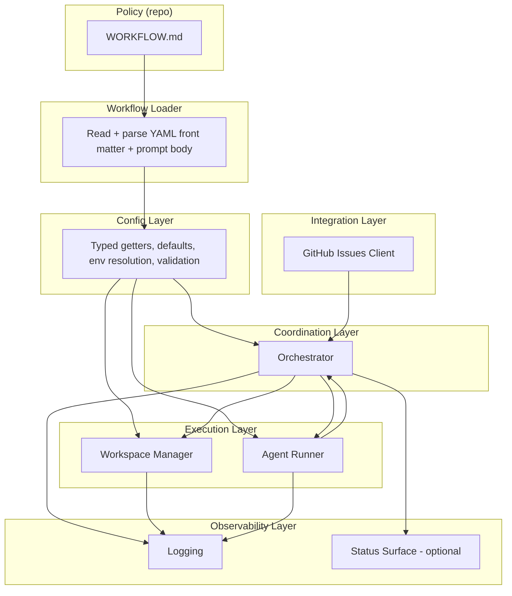
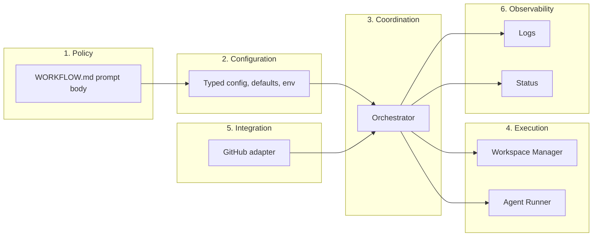

# 02 — System Overview

Rust implementation notes for **SPEC §3**. Diagrams use **Mermaid**.

---

## 3.1 Main Components

The following diagram maps the eight main components and their dependencies.

| # | Component | Responsibility | Implementation doc |
|---|-----------|----------------|--------------------|
| 1 | **Workflow Loader** | Read `WORKFLOW.md`; parse YAML front matter + prompt body; return `{ config, prompt_template }`. | [04-workflow-spec.md](04-workflow-spec.md) |
| 2 | **Config Layer** | Typed getters, defaults, `$VAR` env resolution, path normalization, dispatch preflight validation. | [05-configuration.md](05-configuration.md) |
| 3 | **Issue Tracker Client** | Fetch candidates, fetch states by IDs, fetch terminal issues; normalize to domain `Issue`. | [10-github-tracker.md](10-github-tracker.md) |
| 4 | **Orchestrator** | Poll tick, in-memory state, dispatch/retry/stop/release, session metrics, retry queue. | [06-orchestration.md](06-orchestration.md), [07-polling-scheduling.md](07-polling-scheduling.md) |
| 5 | **Workspace Manager** | Issue identifier → workspace path; create/reuse dirs; lifecycle hooks; cleanup for terminal issues. | [08-workspace-management.md](08-workspace-management.md) |
| 6 | **Agent Runner** | Create workspace, build prompt, launch Codex app-server subprocess, stream events to orchestrator. | [09-agent-runner.md](09-agent-runner.md) |
| 7 | **Status Surface** (optional) | Human-readable runtime status (e.g. terminal, dashboard). | [12-logging-observability.md](12-logging-observability.md) |
| 8 | **Logging** | Structured logs to configured sinks. | [12-logging-observability.md](12-logging-observability.md) |

---

## 3.2 Abstraction Levels (layers)

- **Policy**: Repo-owned; no Rust crate (file content).
- **Configuration**: Parsed from front matter; see [04-workflow-spec.md](04-workflow-spec.md), [05-configuration.md](05-configuration.md).
- **Coordination**: Orchestrator logic; [06-orchestration.md](06-orchestration.md), [07-polling-scheduling.md](07-polling-scheduling.md).
- **Execution**: Workspace + agent subprocess; [08-workspace-management.md](08-workspace-management.md), [09-agent-runner.md](09-agent-runner.md).
- **Integration**: GitHub Issues API; [10-github-tracker.md](10-github-tracker.md).
- **Observability**: [12-logging-observability.md](12-logging-observability.md).

---

## 3.3 External Dependencies

| Dependency | Rust / implementation |
|------------|------------------------|
| GitHub Issues API | HTTP client (e.g. `reqwest`); auth via `GITHUB_TOKEN`; see [10-github-tracker.md](10-github-tracker.md). |
| Local filesystem | `std::path`, `tokio::fs` (or `std::fs` if sync); workspace root and per-issue dirs. |
| Optional workspace population | e.g. Git CLI in hooks; see [08-workspace-management.md](08-workspace-management.md). |
| Coding-agent executable | Subprocess via `tokio::process` (or similar); JSON-RPC-like over stdio; see [09-agent-runner.md](09-agent-runner.md). |
| Host auth | Env vars (e.g. `GITHUB_TOKEN`); no built-in OAuth flow. |

---

## References

- [SPEC.md](SPEC.md) §3 — System Overview
